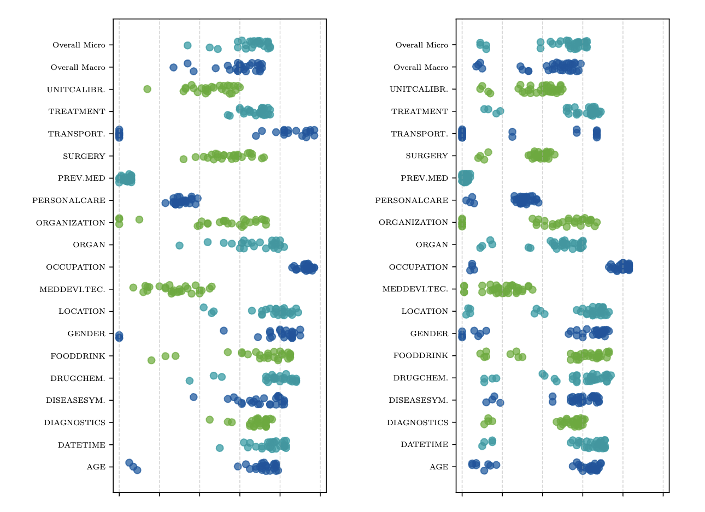
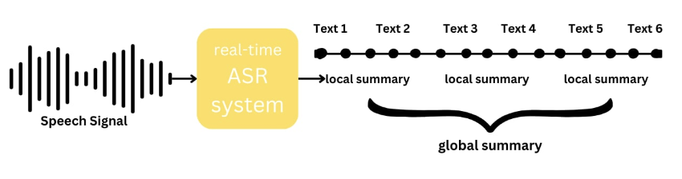
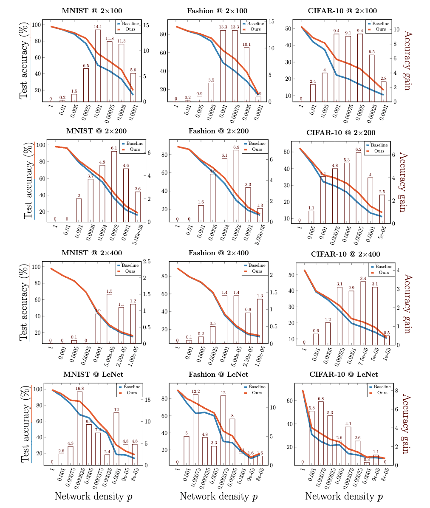

  
I am currently a student at the College of William and Mary. I am fortunate to be supervised by  <a href="https://anhnguyen.me/research/">Anh Totti Nguyen</a>, <a href="https://people.cs.uchicago.edu/~hytruongson/">Hy Truong Son</a>, and <a href="https://tippie.uiowa.edu/people/thiago-serra">Thiago Serra</a>. My research focuses on multimodal AI and trustworthy AI. I am especially interested in (1) quantifying and understanding the limitations and biases of LLMs/VLMs and (2) making LLM systems more interpretable in high-stake domains such as medical and healthcare.

  
My works have been accepted at premier venues such as ACL, NAACL, Interspeech, etc. My most recent project, <a href="https://vlmsarebiased.github.io/">VLMs are Biased</a>, has been featured on <a href="https://news.ycombinator.com/item?id=44169413">Hacker News</a> and garnered attention from <a href="https://x.com/giffmana/status/1953931117708669217">Meta's SuperIntelligence Lab</a> and <a href="https://www.linkedin.com/posts/activity-7360208444731146240-30Mc/">Google DeepMind</a>.

  
I was also an intern at the Machine Learning Research team at <a href="https://www.codametrix.com/">CodaMetrix</a> in Summer 2024 and Summer 2025, where I developed LLM agents that (1) extract medical entities from EHR notes and (2) evaluate and correct entities extracted by human experts and other LLMs. 

Selected Publications
=====
***♠ denotes equal contribution***

  

    
  

  

    
Vision-Language Models are Biased

    
An Vo♠, <b>Khai-Nguyen Nguyen♠</b>, Mohammad Reza Taesiri,  Vy Tuong Dang, Anh Totti Nguyen, Daeyoung Kim 

    
AI for Math Workshop @ ICML 2025, Submitted to NeurIPS 2025

    

      <a href="https://arxiv.org/abs/2505.23941" class="button">paper</a> / <a href="https://vlmsarebiased.github.io/" class="button">website</a> / <a href="https://huggingface.co/datasets/anvo25/vlms-are-biased" class="button">dataset</a> / <a href="https://github.com/anvo25/vlms-are-biased" class="button">code</a>
    
 
    

      We demonstrate that state-of-the-art LLMs are strongly biased toward well-known patterns and propose <b>VLMBias</b>, a VQA benchmark focusing on evaluating visual biases in VLMs. 
    

  

  

    
  

  

    
Sentiment Reasoning for Healthcare

    
<b>Khai-Nguyen Nguyen♠</b>, Khai Le-Duc♠, Bach Phan Tat, Duy Le, Long Vo-Dang, Truong-Son Hy

    
ACL 2025, Industry Track (Oral)

    

      <a href="https://aclanthology.org/2025.acl-industry.82/" class="button">paper</a> / <a href="https://github.com/leduckhai/Sentiment-Reasoning" class="button">code</a>
    

    

      We demonstrate that chain-of-thought distillation improves LLMs performance in sentiment analysis and enables LLMs to produce human-like explanation.
    

  

  

    
  

  

    
Medical Spoken Named Entity Recognition

    
Khai Le-Duc, David Thulke, Hung-Phong Tran, Long Vo-Dang, <b>Khai-Nguyen Nguyen</b>, Truong-Son Hy, Ralf Schluter

    
NAACL 2025, Industry Track (Oral)

    

      <a href="https://arxiv.org/pdf/2406.13337" class="button">paper</a> / <a href="https://huggingface.co/datasets/leduckhai/VietMed-NER">dataset</a>
    

    

      We propose a multilingual dataset for the medical named entity recognition task. 
    

  

  

    
  

  

    
Real-time Speech Summarization for Medical Conversations

    
Khai Le-Duc♠, <b>Khai-Nguyen Nguyen♠</b>, Long Vo-Dang, Truong-Son Hy

    
Interspeech 2024 (Oral)

    

      <a href="https://arxiv.org/pdf/2406.15888" class="button">paper</a> / <a href="https://huggingface.co/datasets/leduckhai/VietMed-Sum" class="button">dataset</a>
    

    

      We improve cascaded medical speech summarization LLMs using high-quality synthetic data.
    

  

  

    
  

  

    
Getting away with more network pruning: From sparsity to geometry and linear regions

    
Jeffrey Cai♠, <b>Khai-Nguyen Nguyen♠</b>, Nishant Shrestha, Aidan Good, Ruisen Tu, Xin Yu, Shandian Zhe, Thiago Serra

    
Workshop on Sparsity in Neural Networks @ ICLR 2023, CPAIOR 2023

    

      <a href="https://arxiv.org/pdf/2301.07966" class="button">paper</a> / <a href="https://github.com/caidog1129/getting_away_with_network_pruning"> code</a>
    

    

      We propose a mathematical theorem of the geometric properties of neural networks and apply it to model pruning.
    

  

